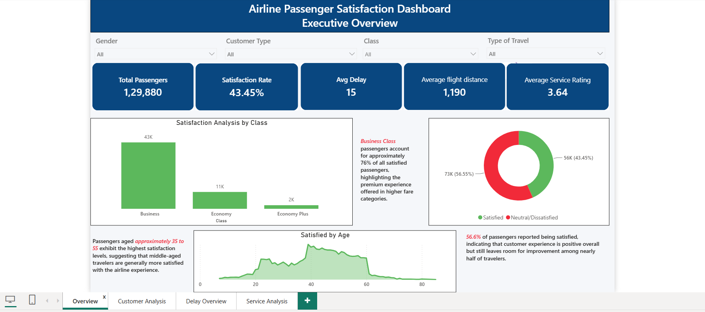
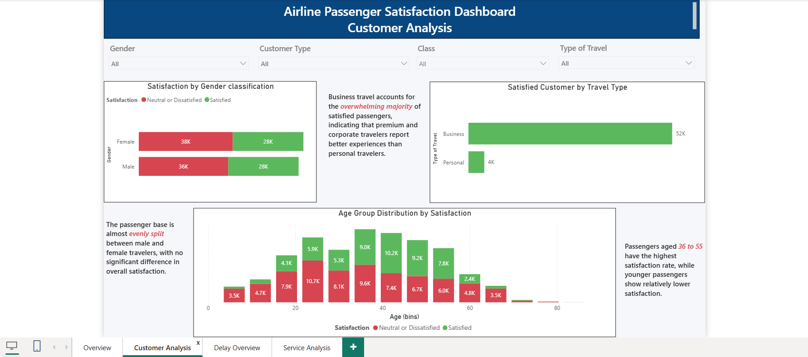
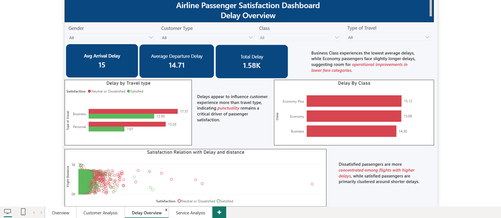
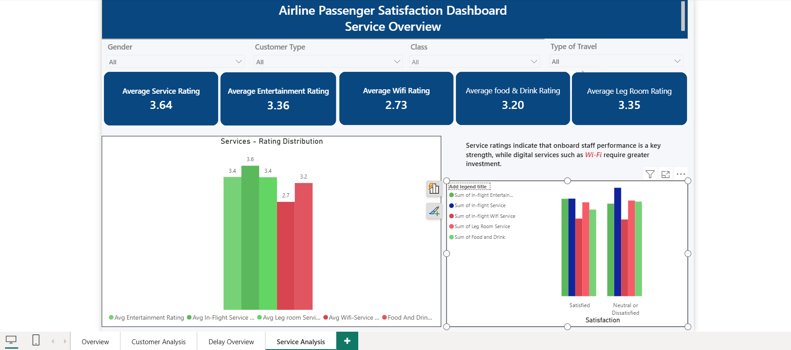

# Airline Passenger Satisfaction Analysis

##  Project Overview

Airline companies collect thousands of passenger feedback records every day, but identifying the factors that influence customer satisfaction can be challenging.

This Power BI dashboard transforms passenger data into interactive visualizations that help stakeholders understand customer behavior, service quality, travel patterns, and operational performance.

---

##  Business Objective

Develop an interactive dashboard that enables airline management to:

- Measure overall passenger satisfaction
- Analyze customer demographics and travel behavior
- Identify factors affecting customer experience
- Monitor flight delays
- Support data-driven operational decisions

---

## 🛠 Tools Used

- Power BI
- Power Query
- DAX

---

##  Dashboard Pages

### Executive Overview

Provides an overall summary of passenger satisfaction, customer distribution, flight distance, service ratings, and key KPIs.

---

### Customer Analysis

Explores satisfaction across gender, age groups, travel type, and passenger class.

---

### Delay Analysis

Analyzes arrival delays, departure delays, travel class, and the relationship between delays and passenger satisfaction.

---

### Service Analysis

Evaluates onboard services including Wi-Fi, food, entertainment, seat comfort, cleanliness, and other service ratings.

---

## 📈 Key Insights

- Business Class passengers report the highest satisfaction levels.
- Passengers aged 35–55 show the strongest satisfaction rates.
- Business travelers are considerably more satisfied than personal travelers.
- Longer delays are strongly associated with customer dissatisfaction.
- Service quality significantly influences overall passenger experience.

---

## Business Impact
This dashboard enables airline managers 
- to identify the primary drivers of passenger satisfaction
- monitor operational delays, evaluate service performance
- prioritize improvements that enhance customer experience and support data-driven decision-making.
  
⭐ If you found this project interesting, feel free to explore my other analytics projects.
